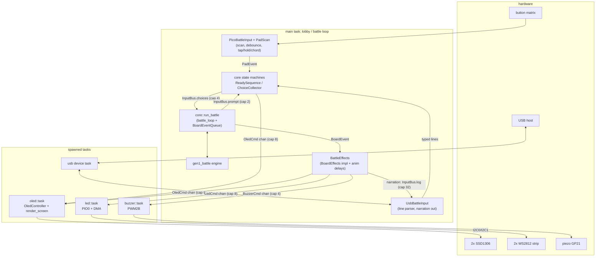
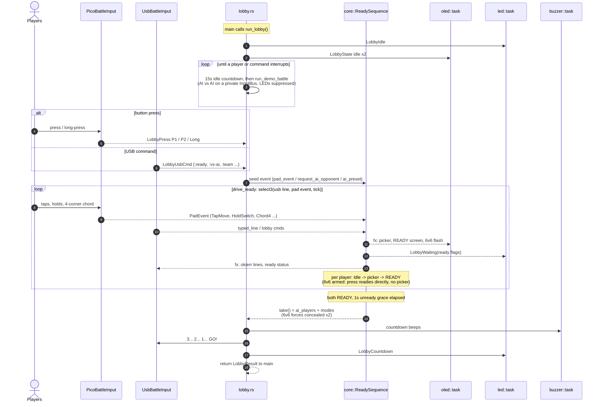
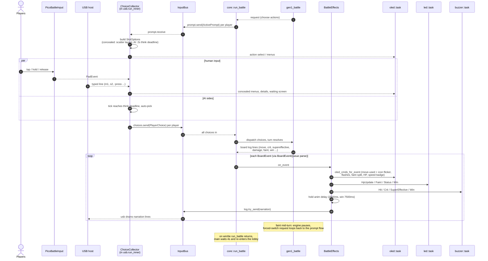

# Firmware interactions (mega_blastoise_fw)

How the RP2040 firmware's pieces talk to each other. Three layers:

1. **Spawned embassy tasks** (`subsystems/`): OLED, LED strips, buzzer, USB
   device. Each owns its hardware and drains a static command channel, so the
   game logic never blocks on IO.
2. **The main task** (`main.rs`): an endless `lobby -> battle -> lobby` loop.
3. **Shared core** (`mega-blastoise-core`): ALL display logic (`OledCmd` ->
   `OledController` -> `render_*`) and ALL input semantics (`ReadySequence`,
   `ChoiceCollector`) live here, identical to the web build (zero-drift rule).
   The firmware contributes raw IO only: matrix scanning, CDC bytes, I2C/PIO/PWM.

## Task and channel topology

The `OledCmd`/`LedCmd`/`BuzzerCmd` channels are fire-and-forget statics
(`subsystems::oled::send` etc.), callable from anywhere in the main task.
`InputBus` is the battle's rendezvous: the runner prompts, input sources answer,
effects narrate.

## Lobby: demo, ready-up, countdown

`run_lobby_inner` (lobby.rs) knows nothing about GPIO or USB; it sees
`LobbyEvent`s through the `LobbyInput` trait, whose USB+buttons impl does the
racing.

Main then seeds the RNG, draws the two teams (3 mons, or 6 when the chord
armed 6v6), uploads them to a fresh engine, sends `TeamInit` to the LEDs, and
hands `UsbBattleInput` the AI flags and control modes for the battle.

## Battle: one turn

`run_battle` races `battle_loop` against the input future
(`BattleController::run`, which is `usb.run_inner(bus, Some(buttons))`; the
`ChoiceCollector` inside owns menus, concealed scatter, and AI think timers).

The oled task itself is the last hop: it applies each `OledCmd` to the shared
`OledController`, re-renders the affected player's `Screen` into a framebuffer,
flushes over I2C, and mirrors into a shadow framebuffer for `oledfb|` dumps
(RTT/USB) used by headless testing.
